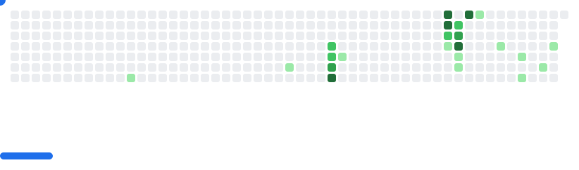

# Hi there! 
---

```python
class Profile:
    def __init__(self):
        self.name = "Gisell"
        self.role = "Data Science Student"

    def say_hi(self):
        print(f"Hello 👋, I'm {self.name} — a {self.role}!")

me = Profile()
me.say_hi()
```
---

## 🚀 About Me  
- 🔭 Currently studying **Data Science**  
- 📚 Into **Machine Learning, AI, and Analytics**  
- 💡 Passionate about turning data → insights → action  
- 🎮 Outside of data world, I love games & creative stuff!

---

<h2 align="left">🛠️ Tech Stack</h2>

<h3 align="center">Languages</h3>
<div align="center">
  
  
  
  
  
  
  
  
  
  
  
</div>

<h3 align="center">Databases</h3>
<div align="center">
  
  
</div>

<h3 align="center">Data Science & ML</h3>
<div align="center">
  
  
  
  
  
  
  
  
  
  
  
  
  
</div>

<h3 align="center">Tools & Environment</h3>
<div align="center">
  
  
  
  
  
  
  
  
  
</div>

---
###

<div align="center">

  <!-- GitHub Streak -->
  <picture>
    <source 
      media="(prefers-color-scheme: dark)" 
      srcset="https://streak-stats.demolab.com?user=serafiua&theme=dracula&hide_border=false&border_radius=10" />
    <source 
      media="(prefers-color-scheme: light)" 
      srcset="https://streak-stats.demolab.com?user=serafiua&theme=default&hide_border=false&border_radius=10" />
    
  </picture>


###

<picture>
  <source media="(prefers-color-scheme: dark)" srcset="images/breakout-dark.svg">
  <source media="(prefers-color-scheme: light)" srcset="images/breakout-light.svg">
  
</picture>
